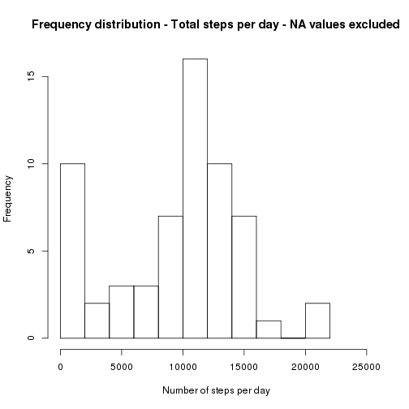

## Loading and preprocessing the data
We define here a generic function which will download a web based resource optionally unzipping if it required


```r
dataLoader <- function(vDataFile, vSourceURL, unzip = FALSE){    
    if(!file.exists(vDataFile))
        {
        vDestFile = basename(vSourceURL)
        message("Downloading data file - please wait ... ", appendLF = FALSE)
        download.file(url = vSourceURL, destfile = vDestFile, method = "curl", quiet = TRUE)
        message("Done", appendLF = TRUE)
        if(unzip == TRUE)
            {
            message("Unzipping data file - please wait ... ", appendLF = FALSE)
            unzip(vDestFile, overwrite = TRUE)
            }
        message("Done", appendLF = TRUE)
        }
    }
```

The above defined function is used to download the activity.csv data from  
https://d396qusza40orc.cloudfront.net/repdata/data/activity.zip


```r
dataLoader("activity.csv", "https://d396qusza40orc.cloudfront.net/repdata/data/activity.zip", unzip = TRUE)
df.RawActivityData <- read.csv("activity.csv", header = TRUE, stringsAsFactors = TRUE, na.strings = "NA")
```

## What is mean total number of steps taken per day?
We define here a generic histogram plotting function


```r
histogramPlotter <- function(dataToPlot, breaks = 10, main = "", xlab = "", ylab = "") {    
    v.XMax = max(dataToPlot)
    hist(dataToPlot,
        breaks = breaks,
        main = main,
        xlab = xlab,
        ylab = ylab,
        xlim = c(0, v.XMax * 1.2)
    )
}
```

A simple histogram yields a frequency distribution of the total number of steps taken per day.  
Missing values are not imputed in the plotted data.  
The tapply function is used to sum the total number of steps for each day.  


```r
histogramPlotter(as.vector(
                    tapply( df.RawActivityData$steps, 
                            df.RawActivityData$date, 
                            sum, 
                            na.rm = TRUE, 
                            simplify = TRUE)
                          ),
                breaks = 10, 
                main = "Frequency distribution - Total steps per day - NA values excluded", 
                xlab = "Number of steps per day", 
                ylab = "Frequency"
                )
```

 

Insight into the most frequently occurring value can be more accurately determined by taking the mean and median number of steps per day. Because of the significant number of 'low count' days (the leftmost bin) the mean will be slightly low skewed relative to the median.

Mean:


```r
mean(tapply(df.RawActivityData$steps, df.RawActivityData$date, sum, na.rm = TRUE))
```

```
## [1] 9354.23
```

Median:


```r
median(tapply(df.RawActivityData$steps, df.RawActivityData$date, sum, na.rm = TRUE))
```

```
## [1] 10395
```

## What is the average daily activity pattern?
A line graph of the number of steps per 5 minute, averaged over all available days, gives an insight into daily activity.  
Missing values are not imputed in the plotted data.


```r
with(df.RawActivityData, {
    a.StepsPerInterval <- tapply(steps, interval, mean, na.rm = TRUE) 

    # Generate 3 vectors to neatly annotate the X axis
    # This allows control over exactly how many ticks are presented and where they fall
    v.XAxisTickHours <- seq(from = 0, to = 23, by = 3.0)
    v.XAxisTickLabels <- sprintf("%02d:00", v.XAxisTickHours)

    # Add the very last label so the graph has a clear end-label
    v.XAxisTickLabels <- c(v.XAxisTickLabels, "23:55")
    
     # Add the positions of the specified tick marks to the X labels vector we pass to the axis function
    v.XAxisTickPositions <- vector(mode="numeric", length=0)
    for(iterator in v.XAxisTickHours) 
        {
        v.XAxisTickPositions <- c(v.XAxisTickPositions, 
                                  match(as.character(iterator * 100), names(a.StepsPerInterval)))
        }
    v.XAxisTickPositions <- c(v.XAxisTickPositions, match("2355", names(a.StepsPerInterval)))
    
    # Make the plot
    plot(a.StepsPerInterval, 
         type = "l", 
         xaxt = "n", 
         main = "Daily Activity Pattern - Mean Over All Days", 
         xlab = "Time Of Day", 
         ylab = "Steps Per 5 Minute Interval")

    axis(side = 1, 
         at = v.XAxisTickPositions, 
         labels = v.XAxisTickLabels)
    }
)
```

 

The busiest 5 minute interval is found by applying R's which.max function to the data.


```r
with(df.RawActivityData, {
    a.StepsPerInterval <- tapply(steps, interval, mean, na.rm = TRUE) 

    # Determine in which 5 minute interval the peak activity occurs
    v.PeakActivityInterval <- sprintf("%04d", as.numeric(names(which.max(a.StepsPerInterval))))
    v.FormattedPeakActivityInterval <- sprintf("%02s:%02s", 
                                                substr(v.PeakActivityInterval, 1, 2), 
                                                substr(v.PeakActivityInterval, 3, 4))
    
    print(paste("Peak activity occurs in interval", v.FormattedPeakActivityInterval))
    }
)
```

```
## [1] "Peak activity occurs in interval 08:35"
```

## Imputing missing values
A simple count of the NA values in the 'steps' column shows how many intervals are missing data


```r
with(df.RawActivityData, {
    v.NumberOfMissingValues = sum(is.na(steps))
    v.PercentageMissingValues =  (v.NumberOfMissingValues / length(steps)) * 100
    v.PercentMessage <- paste(as.character(signif(v.PercentageMissingValues, digits = 4)), "%", sep = "")
    print(paste("Number of NA values in dataset = ", 
                v.NumberOfMissingValues, 
                " (", v.PercentMessage, ")", 
                sep = ""))
    }
)
```

```
## [1] "Number of NA values in dataset = 2304 (13.11%)"
```

It is desired to observe the effect of imputing missing (NA) values in the data.  

The imputation strategy chosen is *hot-deck last observation carried forward.*  
This will simply replace any single NA observation with same value as the observation immediately preceding it.
This replacement strategy is chosen in favour of other more complex replacement strategies because of it's simplicity.

A **copy** of the original raw data is used when performing the imputation process.


```r
df.CookedActivityData <- df.RawActivityData

# If the very first observation is missing, replace this with 0 to act as a 'seed'
# to be propagated forward until we hit the first valid observation
if(is.na(df.CookedActivityData$steps[1])) {
    df.CookedActivityData$steps[1] = 0
}
 
with(df.CookedActivityData, {
    # Create a vector specifying which observations are NA
    v.MissingIndices <- which(is.na(steps))
    
    # Use this 'missing indices' vector to perform the imputation in the df.CookedActivityData data frame
    # Note that the parent environment is updated
    for(v.Iterator in v.MissingIndices){
        df.CookedActivityData$steps[v.Iterator] <<- df.CookedActivityData$steps[v.Iterator - 1]
        }
    } 
)
```

A second histogram of the post-imputation data looks as follows.  
The plotting technique is identical to that used earlier.


```r
histogramPlotter(as.vector(
                    tapply( df.CookedActivityData$steps, 
                            df.CookedActivityData$date, 
                            sum, 
                            na.rm = TRUE, 
                            simplify = TRUE)
                          ),
                breaks = 10, 
                main = "Frequency distribution - Total steps per day - NA values imputed", 
                xlab = "Number of steps per day", 
                ylab = "Frequency"
                )
```

 

It is desired to investigate if the imputation method chosen has any effect upon the mean and median values observerd earlier.

Mean:


```r
mean(tapply(df.CookedActivityData$steps, df.CookedActivityData$date, sum, na.rm = TRUE))
```

```
## [1] 9354.23
```

Median:


```r
median(tapply(df.CookedActivityData$steps, df.CookedActivityData$date, sum, na.rm = TRUE))
```

```
## [1] 10395
```

These mean and median values are **identical** to those derived earlier from the original non-imputed data.  

This is a remarkable result and it deserves closer investigation.  

The individual total steps per day for the non-imputed and the imputed data sets are compared day by day to check for differences. A vector of the differences is generated and the unique values within this vector are displayed.


```r
unname(unique(tapply(df.RawActivityData$steps, df.RawActivityData$date, sum, na.rm = TRUE) - 
             tapply(df.CookedActivityData$steps, df.CookedActivityData$date, sum, na.rm = TRUE)))
```

```
## [1] 0
```

This zero result can therefore only be explained by the fact that the last known good value(s) immediately preceeding any run of NA values, is always zero. Since the imputation strategy is hot-deck last observation carried forward, this zero value does not alter the daily mean or median values. This observation is further strengthend by examining the *distribution* of NA values throughout the data. 


```r
unname(unique(tapply(is.na(df.RawActivityData$steps), df.RawActivityData$date, sum)))
```

```
## [1] 288   0
```

Summing the number of NA values per day, and checking for the number of unique results found, shows that the NA values, when they occur, always start at interval 0 for a given day and run for a complete day of 288 observations.

## Are there differences in activity patterns between weekdays and weekends?
It is desired to investigate if there is an observable difference in activity between weekdays and weekends.  
In order to perform this analysis it will be necessary to quantify which dates correspond to weekdays and which not.  
A factor specifying if the day of the week is a weekday or a weekend day is added to the data.  


```r
# Add an extra column to the 'cooked data' data frame containing the string 'weekend' or 'weekday'
# depending upon the date contained in the date column
df.CookedActivityData$daytype <- sapply(df.CookedActivityData$date, function(x) {
        if(weekdays(as.Date(x)) %in% c("Saturday", "Sunday")) 
            {"weekend"} 
        else 
            {"weekday"}
        }
    )

# Convert the string to a factor
df.CookedActivityData$daytype <- as.factor(df.CookedActivityData$daytype)
```

Now that the required factor has been added to the imputed dataset, this can be used to provide insight into the differences between weekday and weekend activity. A pair of plots indicate the difference between the average number of steps per day, factored by the day type (weekday or weekend day).  

Note the term 'weekend' in this context is taken to mean the days Saturday and Sunday.


```r
par(mfrow = c(2,1))

# Adjust the margins for the first of the panel plots
par(mar = c(0, 4, 4, 4))
with(df.CookedActivityData, {
    
    # Find the maximum value to which the Y axis should be scaled
    v.MaximumYValue <- max(tapply(df.CookedActivityData$steps, 
                                 df.CookedActivityData$interval, 
                                 mean, 
                                 na.rm = TRUE))
    
    # Filter the 'weekend' measurements
    df.CookedFactoredActivityData <- subset(df.CookedActivityData, df.CookedActivityData$daytype == "weekend")
    a.StepsPerInterval <- tapply(df.CookedFactoredActivityData$steps, 
                                 df.CookedFactoredActivityData$interval, 
                                 mean, 
                                 na.rm = TRUE)

    # Make the plot of 'weekend' activity
    plot(a.StepsPerInterval, 
         type = "l", 
         xaxt = "n",
         yaxt = "n",
         ylab = "",
         ylim = c(0, v.MaximumYValue * 1.25)
         )
    
    axis(side = 4, at = seq(from = 0, to = v.MaximumYValue * 1.25, by = 50))
    legend(x = 100, y = v.MaximumYValue * 1.25, "weekend", bty = "n")
    mtext("Steps Per 5 Minute Interval", side=4, line=3)

    # Adjust the margins for the second of the panel plots
    par(mar = c(4, 4, 0, 4))

    # Filter the 'weekday' measurements
    df.CookedFactoredActivityData <- subset(df.CookedActivityData, df.CookedActivityData$daytype == "weekday")    
    a.StepsPerInterval <- tapply(df.CookedFactoredActivityData$steps, 
                                 df.CookedFactoredActivityData$interval, 
                                 mean, 
                                 na.rm = TRUE)
    
    # Make the plot of 'weekday' activity
    plot(a.StepsPerInterval, 
         type = "l", 
         xaxt = "n",
         yaxt = "n",
         xlab = "Time Of Day", 
         ylab = "Steps Per 5 Minute Interval",
         ylim = c(0, v.MaximumYValue * 1.25)
    )
    
    axis(side = 2, at = seq(from = 0, to = v.MaximumYValue * 1.25, by = 50))
    legend(x = 100, y = v.MaximumYValue * 1.25, "weekday", bty = "n")

    # Generate 3 vectors to neatly annotate the X axis
    # This allows control over exactly how many ticks are presented and where they fall
    v.XAxisTickHours <- seq(from = 0, to = 23, by = 3.0)
    v.XAxisTickLabels <- sprintf("%02d:00", v.XAxisTickHours)

    # Add the very last label so the graph has a clear end-label
    v.XAxisTickLabels <- c(v.XAxisTickLabels, "23:55")
    
    # Add the positions of the specified tick marks to the X labels vector we pass to the axis function
    v.XAxisTickPositions <- vector(mode="numeric", length=0)
    for(iterator in v.XAxisTickHours) 
        {
        v.XAxisTickPositions <- c(v.XAxisTickPositions, 
            match(as.character(iterator * 100), names(a.StepsPerInterval)))
        }
    v.XAxisTickPositions <- c(v.XAxisTickPositions, match("2355", names(a.StepsPerInterval)))

    axis(side = 1, 
         at = v.XAxisTickPositions, 
         labels = v.XAxisTickLabels
         )    
    }
)
```

 

The differences between weekday and weekend activity can be observed. The average weekday activity displays a spike just before 09:00 with relatively less activity for the rest of the day.  The weekend activity shows a more even distribution of activity throughout the day.
